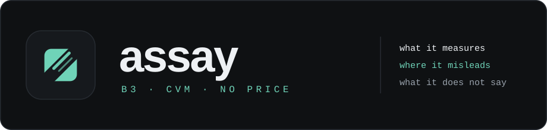
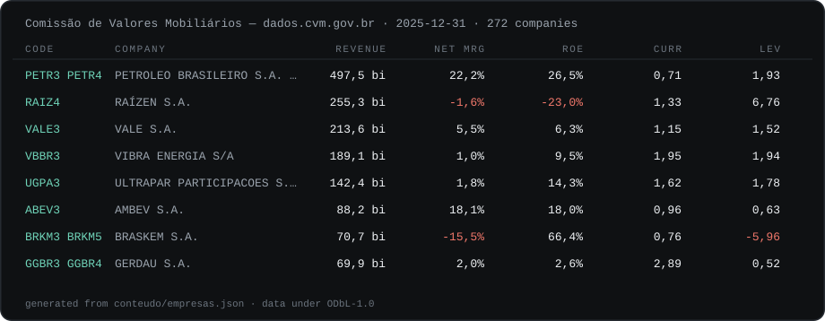

# assay



> **Fundamentals of Brazil's listed companies, with the source and the date on every number —
> and, next to every indicator, the case where reading it naively leads to the wrong
> conclusion.** No price. No recommendation.

[](https://github.com/Navesz/assay/actions/workflows/verificar.yml)
[](LICENSE)
[](#where-the-numbers-come-from)
[](#whats-in-the-table)
[](#whats-in-the-table)

[Open the site](https://navesz.github.io/assay/) ·
[Data source](https://dados.cvm.gov.br/dados/CIA_ABERTA/DOC/DFP/DADOS/) ·
[Built and gated by rebar](https://github.com/Navesz/rebar)



Those are the published numbers, generated from `conteudo/empresas.json` by
`ferramental/imagens.mjs` — not a screenshot, and not an example typed by hand. The same
artifact renders the page.

```bash
npm run dev                          # the site
node ferramental/coletar.mjs         # re-collect from the CVM and rewrite the dataset
npm run verificar                    # the whole gate: lint, types, tests, build, published paths
```

---

## Why this exists

Every site that publishes fundamentals shows you a number. Almost none show you where the
number breaks.

Return on equity looks best exactly when equity is smallest — so a company that borrowed
its way to a thin equity base outranks one that did not. Current ratio counts inventory that
is not moving. Revenue growth counts an acquisition as if it were demand. None of that is a
secret; it is just never printed next to the number, and the number is what people act on.

So this site prints it. Every indicator carries three lines, and two of them are the ones
nobody writes:

| | |
|---|---|
| **what it measures** | the ordinary definition |
| **where it misleads** | the concrete case where the naive reading is wrong |
| **what it does not say** | the question this number is not an answer to |

The schema in `conteudo/indicadores.ts` makes both of the last two **mandatory**. An
indicator without them does not compile — the build dies, not the page. If no limit can be
written for a number, the number was not understood well enough to publish.

## Where the numbers come from

Every figure is derived from the annual financial statements (DFP) each company filed with
the **CVM**, Brazil's securities regulator, and published as open data. Nothing is scraped
from a broker, and nothing is typed in by hand.

`ferramental/coletar.mjs` downloads the CVM's ZIP files, reads them with a ZIP reader written
over `zlib` (`ferramental/zip.mjs`), and writes `conteudo/empresas.json`. Four things in that
pipeline are not obvious and are the difference between right and plausible:

- **`ORDEM_EXERC`.** Each filing carries the current year *and* the previous one, in the same
  file. Taking the wrong one silently publishes last year's balance sheet. The filter is
  `DT_FIM_EXERC === DT_REFER`, which does not depend on the string `ÚLTIMO` surviving the
  file's encoding.
- **`VERSAO`.** A company can refile. Only the highest version of each statement is kept.
- **`ESCALA_MOEDA`.** Some statements are filed in thousands. A value marked `MIL` is
  multiplied by 1,000 before anything else happens.
- **Sector charts of accounts.** Banks and insurers use a different chart, where account
  `1.01` is *Caixa e Equivalentes de Caixa* rather than *Ativo Circulante*. Current ratio and
  leverage computed across that chart are not wrong — they are meaningless. Those companies
  are **excluded**, and the count and the reason are published on the page, not hidden.

| | |
|---|---|
| source | Comissão de Valores Mobiliários — `dados.cvm.gov.br` |
| statement | DFP, fiscal year ending 2025-12-31 |
| companies filed | 425 |
| companies published | **272** — those with a trading code |
| excluded | 13, each with the reason recorded |
| data licence | **ODbL-1.0**, share-alike |

## What's in the table

Six indicators, each computed from the filed statements and each carrying its own limits:

| indicator | from | account |
|---|---|---|
| net margin | net profit ÷ revenue | `3.11` ÷ `3.01` |
| operating margin | operating result ÷ revenue | `3.05` ÷ `3.01` |
| return on equity | net profit ÷ equity | `3.11` ÷ `2.03` |
| current ratio | current assets ÷ current liabilities | `1.01` ÷ `2.01` |
| leverage | total liabilities ÷ equity | (`2.01` + `2.02`) ÷ `2.03` |
| revenue growth | compound annual rate over the filed series, 2021–2025 | `3.01` per year |

Revenue growth is a **CAGR**, not one year against the last: the collector reads the income
statement for every year from 2021 to 2025 and computes `(last / first) ^ (1 / years) - 1`.
It is only produced when both ends are positive — from a loss to a profit there is no rate,
and inventing one would be the first wrong number on the page. 405 of the 425 companies have
one; the rest print `—`.

Sortable in both directions. **A missing value always sorts last**, in both directions —
treating absence as zero would put the companies with no data at the top of "smallest first",
as if they were the best, which is the worst possible outcome for a table that promises to
say where each number came from.

## What it deliberately does not have

**No price.** No P/E, no P/B, no dividend yield, no market cap. Price is not in the CVM's
open data, and pulling it from a broker's API would mean a number with a different source,
a different timestamp and a different licence sitting in the same row as the audited ones —
with nothing on screen saying so. The site would stop being able to keep its one promise.

**No recommendation.** No suggested portfolio, no score, no buy ranking, no per-ticker
analysis. This is a reading tool, not advice.

## The stack

| piece | choice | why |
|---|---|---|
| framework | Next 16, App Router, `output: "export"` | publishes to GitHub Pages with no server |
| rendering | fully static | `og:image` has to exist for scrapers that run no JavaScript |
| UI | shadcn, `base-nova` style, over `@base-ui/react` | no Radix |
| styling | Tailwind 4 | comes with the preset |
| content | `conteudo/*.json`, validated at build time | invalid content kills the build, not the page |
| data | `conteudo/empresas.json`, derived from the CVM | one artifact, regenerable from the source |
| brand | `public/marca.svg` | one file; the favicon, the header, the og card and both app icons are all derived from it |

Zero hand-drawn assets: `node ferramental/imagens.mjs` reads `public/marca.svg` and
`app/globals.css` and regenerates the og card, the two manifest icons, the banner above and
the table sample. Change the mark, run it once, and all five follow.

## The gate

`npm run verificar` is one command and CI calls only it, so a step cannot be turned off in
the YAML while the badge stays green:

```
lint → typecheck → test → published-paths proof → build → published-paths
```

The last step is the one worth explaining. This site lives in a **folder**
(`navesz.github.io/assay`), and Next does not carry the `basePath` everywhere: with
`images.unoptimized`, `next/image` writes the `src` raw, and `app/manifest.ts` emitted
`"start_url": "/"` pointing at the root of the domain. Neither is a type, lint or build
error — they are 404s on the published site with everything green. So `testes/publicado.mjs`
reads the built `out/` and fails any absolute path that does not start with the site's
folder, with one document that fails and one that passes for each format. A site at the root
of a domain reports `n/a` and leaves the denominator instead of collecting a free pass.

Hooks are versioned, not local config:

```bash
node .githooks/install.mjs
```

`pre-commit` scans staged content for secrets; `commit-msg` blocks AI co-authorship trailers
before the commit exists.

## Licence

**Code:** Apache-2.0 — see [LICENSE](LICENSE) and [NOTICE](NOTICE).

**Data:** the figures derive from CVM open data under **ODbL-1.0**, which is share-alike:
a derived database must be distributed under the same licence. `conteudo/empresas.json`
carries its licence field inside it, and the page prints it under the table.

Copyright 2026 Naves.
